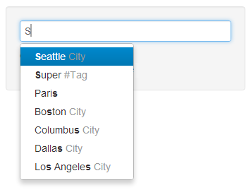

Twitter Bootstrap AngularJS Commandbar directive
========================
* * *

master<br />
Sylvain Daclin [@sdaclin](https://twitter.com/#!/sdaclin)

An AngularJS Directive to get a commandbar.



This directive is based on Twitter's Bootstrap Typeahead component and more particulary github.com/tcrosen/ enhanced version of this plugins.<br />
<http://twitter.github.com/bootstrap/javascript.html#typeahead><br />
<https://github.com/tcrosen/twitter-bootstrap-typeahead>

About
-----------------
Many thanks to [@mdo](https://twitter.com/#!/mdo) et [@fat](https://twitter.com/#!/fat) from [@twitter](https://twitter.com/) for their work on Twitter Bootstrap.<br />
Many thanks to [@rerrify](https://twitter.com/#!/rerrify) for is enhanced version of typeahead.<br />

I need some more fonctionnality so I forked tcrosen repository to provide :

- an AngularJs directive : **<input commandbar id="commandbarId" type="text" ng-model="commandbarValue" data="commandbarData(query)" callback="commandbarCallback(dataSelected)" placeholder="Type command ..." />**
- ability to specify a data source from an angular controller method (tcrosen only propose an array value or an ajax function)
- ability to specify an angular callback handler which is triggered when a command is selected
- ability to set commands as javascript objects in order to get a command object in the callback handler instead of a simple value

Futur enhancement
-----------------
- possibility to set an angular template for each command
- code enhancement to respect angular best practices (need to improve my angular skills...)
- code cleaning to remove ajax javascript typeahead functionnality in order to rely only on angular datasource function (which provide ajax datasource by the use of angular $resources module)

Required
-----------------
* Twitter Bootstrap 2.0+
* AngularJS 1.0.3+
* jQuery 1.8.3+

Installation
-----------------
1) Download [Bootstrap](https://github.com/twitter/bootstrap) & [jQuery](http://docs.jquery.com/Downloading_jQuery) & [AngularJs](http://angularjs.org/)

2) Download this plugin.

- [ZIP](https://github.com/sdaclin/Bootstrap-Angular-CommandBar/archive/master.zip)
- [Clone in Windows](github-windows://openRepo/https://github.com/sdaclin/Bootstrap-Angular-CommandBar)
- `git clone git://github.com/sdaclin/Bootstrap-Angular-CommandBar.git`

3) Include files in your HTML. The minimum required for this plugin are:

    <!-- Bootstrap CSS -->
    <link href="css/bootstrap.css" rel="stylesheet">

    <!-- Angular -->
    <script src="http://ajax.googleapis.com/ajax/libs/angularjs/1.0.3/angular.min.js"></script>

    <!-- jQuery-->
    <script src="http://ajax.googleapis.com/ajax/libs/jquery/1.8.3/jquery.min.js"></script>

    <!-- bootstrap-commandbar -->
    <script src="js/bootstrap-commandbar.js" type="text/javascript"></script>
    <script src="js/bootstrap-commandbar-angular.js" type="text/javascript"></script>

4) add dependency in your angular module

```javascript
    angular.module('yourapp', ['commandBar']) [...]
```

5) add a commandbar in your html

```html
    <input commandbar id="commandbarId" type="text" ng-model="commandbarValue" data="commandbarData(query)" callback="commandbarCallback(dataSelected)" placeholder="Type command ..." />
```

6) add commandbar handler in your angular controller
```javascript
    function CommandBarCtrl($scope) {
        $scope.commandbarData = function(query){
            console.log('commandbarData requested for query : '+query + '... but returning demo data set');

            var demoDataset = [
                { name: 'Paris'},
                { name: 'NY'},
                { name: 'Toronto', category : 'City' },
                { name: 'Montreal', category : 'City' },
                { name: 'New York', category : 'City' },
                { name: 'Buffalo', category : 'City' },
                { name: 'Boston', category : 'City' },
                { name: 'Columbus', category : 'City' },
                { name: 'Dallas', category : 'City' },
                { name: 'Vancouver', category : 'City' },
                { name: 'Seattle', category : 'City' },
                { name: 'Los Angeles', category : 'City' },
                { name: 'Great', category : '#Tag' },
                { name: 'Mega', category : '#Tag' },
                { name: 'Super', category : '#Tag' },
                { name: 'Over', category : '#Tag' }
            ];
            console.log(demoDataset);
            return demoDataset;
        };
        $scope.commandbarCallback = function(data) {
            console.log('commandbarCallback triggered with data : ');
            console.log(data);
        };
    }
```
An example exists in `/demo` directory

Change Log
-----------------